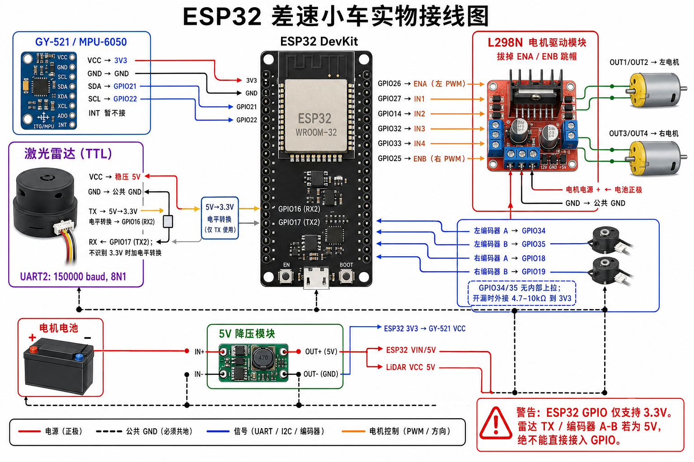

# 实车硬件接线图（ESP32 / 雷达 / IMU / 电机）

> 当前接线的唯一参考。旧版 USB 串口架构说明保留在
> [hardware_principle.md](hardware_principle.md)，仅作备份，不要按其中的 USB 主链路接线。
>
> **先断电再接线。** ESP32 的 GPIO 只能承受 3.3 V 逻辑电平；5 V 电源和 5 V TTL 信号不是一回事。



> 图片适合按图接线；引脚、电平和安全限制以本文的文字表格为准。

## 1. 总接线图

```text
                    ┌────────────── 笔记本电脑 ──────────────┐
                    │  连接 ESP32 Wi-Fi: car-esp32            │
                    └──────────────────┬──────────────────────┘
                                       Wi-Fi
                    ┌──────────────────┴──────────────────────┐
                    │                 ESP32                   │
                    │                                          │
  LiDAR TX ──[5V→3.3V 电平转换]──> GPIO16  (UART2 RX)          │
  LiDAR RX <──[必要时 3.3V→5V转换]── GPIO17  (UART2 TX)         │
                    │                                          │
  GY-521 SDA ─────────────────────> GPIO21                     │
  GY-521 SCL ─────────────────────> GPIO22                     │
                    │                                          │
  左编码器 A ──────────────────────> GPIO34  (仅输入)           │
  左编码器 B ──────────────────────> GPIO35  (仅输入)           │
  右编码器 A ──────────────────────> GPIO18                    │
  右编码器 B ──────────────────────> GPIO19                    │
                    │                                          │
  GPIO26 ──────────────────────────> L298N ENA (左 PWM)        │
  GPIO27 ──────────────────────────> L298N IN1                 │
  GPIO14 ──────────────────────────> L298N IN2                 │
  GPIO32 ──────────────────────────> L298N IN3                 │
  GPIO33 ──────────────────────────> L298N IN4                 │
  GPIO25 ──────────────────────────> L298N ENB (右 PWM)        │
                    └──────────────────────────────────────────┘

电机电池 ──> L298N 电机电源端 ──> 左、右电机
电机电池 ──> 5V 降压模块 ──> ESP32 VIN/5V 输入、LiDAR VCC
ESP32 3V3 ───────────────────> GY-521 VCC
所有 GND（电池、降压、ESP32、L298N、LiDAR、GY-521、编码器）必须相连。
```

## 2. 激光雷达（TTL，TX / RX / GND / VCC）

雷达供电按你已确认的要求使用 **5 V**；数据线使用 ESP32 的 UART2。当前固件设为 **150000 baud、8N1**。

| 雷达引脚 | 应接到哪里 | 说明 |
|---|---|---|
| `VCC` | 稳压 5V 降压模块输出 | 不接 ESP32 的 `3V3`；5V 电源要有足够余量。 |
| `GND` | 公共 GND | 必须与 ESP32 GND 相连，否则 UART 没有共同参考。 |
| `TX` | 经 5V→3.3V 电平转换后接 ESP32 `GPIO16` | 这是“雷达发、ESP32 收”。**确认雷达 TX 是 5V TTL 时，绝不能直接接 GPIO16。** |
| `RX` | ESP32 `GPIO17`，必要时先经 3.3V→5V 电平转换 | 这是“ESP32 发、雷达收”。很多 5V 供电雷达仍能识别 3.3V 高电平；不能确认时加转换器。 |

```text
LiDAR VCC  ─────────── 5V 降压输出
LiDAR GND  ─────────── 公共 GND
LiDAR TX   ─ 电平转换 ─ ESP32 GPIO16  (RX2)
LiDAR RX   ─ 电平转换*─ ESP32 GPIO17  (TX2)

* 仅当雷达 RX 不认可 3.3V 高电平时需要。
```

若雷达 `TX` 确认是 5 V，一个简单可用的单向降压方案是电阻分压：雷达 `TX` → **10 kΩ** → 节点 → ESP32 `GPIO16`，该节点再经 **20 kΩ** → GND。节点约为 3.3 V。更稳妥的做法是使用适合 UART 的逻辑电平转换器。接线前请查看雷达标签、说明书或用万用表/示波器确认 `TX` 高电平；**“VCC 是 5 V”不能自动证明 TX 一定是 5 V。**

## 3. GY-521（MPU-6050）

| GY-521 引脚 | ESP32 引脚 | 说明 |
|---|---|---|
| `VCC` | `3V3` | 这样 I2C 上拉也是 3.3V，最安全。 |
| `GND` | `GND` | 公共地。 |
| `SDA` | `GPIO21` | I2C 数据。 |
| `SCL` | `GPIO22` | I2C 时钟。 |
| `INT` | 暂不接 | 当前固件用定时读取，不使用中断脚。 |
| `AD0` | 模块默认即可 | 固件会自动尝试 I2C 地址 `0x68` 与 `0x69`。 |

```text
ESP32 3V3 ─── GY-521 VCC
ESP32 GND ─── GY-521 GND
ESP32 GPIO21 ─ GY-521 SDA
ESP32 GPIO22 ─ GY-521 SCL
```

不要把 GY-521 接到 5V 后再把 SDA/SCL 直接连进 ESP32；某些模块会把 I2C 上拉到供电电压，从而把 5V 加到 GPIO21/22。

## 4. L298N 与两个电机

当前固件通过 ENA / ENB 输出 PWM，所以先**拔掉 L298N 板上 ENA、ENB 的使能跳帽**；否则速度会一直被拉高，ESP32 的 PWM 无法生效。

| L298N 端子 | ESP32 引脚 | 作用 |
|---|---|---|
| `ENA` | `GPIO26` | 左轮 PWM |
| `IN1` | `GPIO27` | 左轮方向 1 |
| `IN2` | `GPIO14` | 左轮方向 2 |
| `IN3` | `GPIO32` | 右轮方向 1 |
| `IN4` | `GPIO33` | 右轮方向 2 |
| `ENB` | `GPIO25` | 右轮 PWM |
| `GND` | ESP32 `GND` | 与全系统公共地 |
| `OUT1` / `OUT2` | 左电机两根线 | 转向相反时对调这两根线，或以后在软件中反向。 |
| `OUT3` / `OUT4` | 右电机两根线 | 同上。 |
| 电机电源 `+` / `Vs` | 电机电池正极 | 名称依模块丝印而定；电压须符合电机与驱动板规格。 |
| 电机电源 `GND` | 电机电池负极 / 公共 GND | 必须与 ESP32 GND 相连。 |

```text
ESP32 GPIO26 ─ L298N ENA          L298N OUT1/OUT2 ─ 左电机
ESP32 GPIO27 ─ L298N IN1
ESP32 GPIO14 ─ L298N IN2          L298N OUT3/OUT4 ─ 右电机
ESP32 GPIO32 ─ L298N IN3
ESP32 GPIO33 ─ L298N IN4
ESP32 GPIO25 ─ L298N ENB
ESP32 GND    ─ L298N GND
```

不要从 ESP32 的 USB 或 `5V` 引脚给电机供电。电机电流会造成掉压和噪声，导致 ESP32 重启。

## 5. 霍尔编码器

| 信号 | ESP32 引脚 |
|---|---|
| 左轮 A 相 | `GPIO34` |
| 左轮 B 相 | `GPIO35` |
| 右轮 A 相 | `GPIO18` |
| 右轮 B 相 | `GPIO19` |
| 编码器 GND | 公共 GND |
| 编码器 VCC | 依编码器额定电压决定；优先 3.3V（若规格允许） |

```text
左编码器 A ─ ESP32 GPIO34       右编码器 A ─ ESP32 GPIO18
左编码器 B ─ ESP32 GPIO35       右编码器 B ─ ESP32 GPIO19
左编码器 GND ─ 公共 GND         右编码器 GND ─ 公共 GND
```

注意：

- ESP32 GPIO 不能直接接受 5V。若编码器必须以 5V 供电且 A/B 输出为 5V，A/B 各路都需要 5V→3.3V 电平转换。
- GPIO34、GPIO35 是**仅输入**引脚，且没有可用的内部上拉。若编码器输出是开漏/开集电极，给 A/B 各加一个 **4.7–10 kΩ** 外部上拉到 `3V3`；不能依赖软件 `INPUT_PULLUP`。
- 编码器 VCC、GND 和 A/B 的线序因电机而异，先以电机标签/说明书为准。

## 6. 供电与共地

```text
                 ┌──────────────> L298N 电机电源 +
电机电池正极 ────┤
                 └──> 5V 降压模块 ──> ESP32 VIN/5V
                                     └> LiDAR VCC (5V)

电机电池负极 ────────────────┬──> L298N GND
                              ├──> 5V 降压模块 GND
                              ├──> ESP32 GND
                              ├──> LiDAR GND
                              ├──> GY-521 GND
                              └──> 编码器 GND

ESP32 3V3 ───────────────────────> GY-521 VCC
```

供电前逐项确认：

1. 降压模块空载输出确实是 5.0V 后，才接 ESP32 和雷达。
2. 雷达 `TX`、编码器 A/B 若为 5V，已先做电平转换，未直接进入 ESP32。
3. 所有模块共地，但电机正电源没有接到 ESP32 `3V3`。
4. USB 烧录时，若同时外接 5V 到 ESP32 的 VIN/5V，请先确认开发板的供电路径允许；不确定时先断开外部 5V，仅用 USB 烧录和调试。

## 7. 当前固件对应关系

本图对应 `src/vehicle_hardware/firmware/esp32_motor_control/src/main.ino`：

| 功能 | 固件设置 |
|---|---|
| ESP32 Wi-Fi | AP：`car-esp32` |
| 电机与编码器遥测 | UDP `192.168.4.1:8888` |
| 雷达透明转发 | UART2 ↔ TCP `192.168.4.1:8889` |
| 雷达 UART | `GPIO16` RX、`GPIO17` TX，150000 baud，8N1 |
| MPU-6050 I2C | SDA `GPIO21`、SCL `GPIO22` |

接线完成后的第一步不是立刻建图，而是先分别验证：雷达是否有 `/scan`、IMU 是否有 `/imu`、手推车轮时 `/odom` 是否有变化。确认三项都正确后再启动实车建图。

## 8. 不经过 ROS 的开环电机测试

当需要区分“ROS/PID 软件问题”和“L298N、电机、电源或接线问题”时，可使用 `esp32_pwm_test.py` 直接发送 UDP PWM：

```bash
# 先只检查命令；不会发包、不会转动。
python3 src/vehicle_hardware/scripts/esp32_pwm_test.py \
  --left 80 --right 80 --duration 1 --dry-run

# 车轮悬空后，左右轮各以 PWM=80 开环运行 1 秒；结束会自动 M 0 0 停车。
python3 src/vehicle_hardware/scripts/esp32_pwm_test.py \
  --left 80 --right 80 --duration 1
```

它绕开 `/cmd_vel`、ROS 2、PID 和编码器，只发送 `M <left_pwm> <right_pwm>` 到 `192.168.4.1:8888`。如果此测试也不转，优先检查电机电源、L298N 的 ENA/ENB 跳帽、公共地和电机线；如果它能转而 `/cmd_vel` 测试不能转，再检查桥接/PID 参数。
